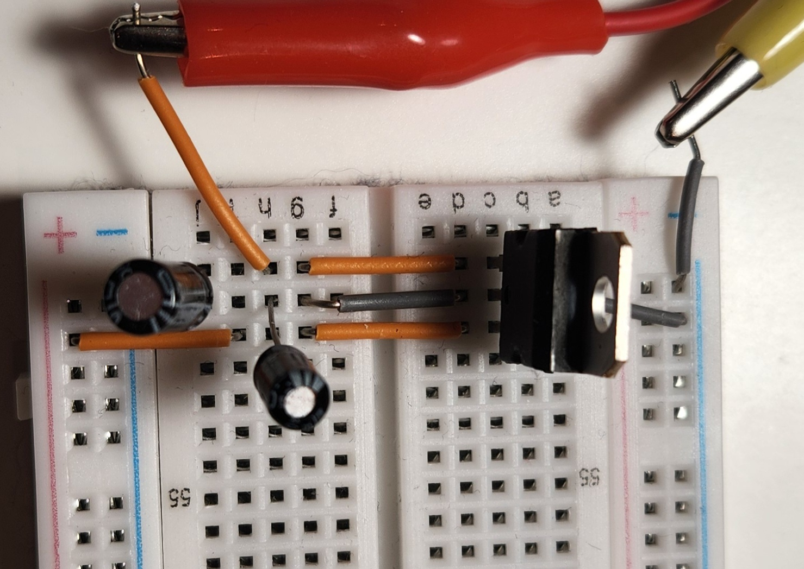

# 5-Bit Binary to Decimal Display (No Microcontrollers)

This is a simple hardware project that turns a 5-bit binary number into a decimal output using 74-series logic chips. It uses a basic binary-to-BCD conversion to drive three 7-segment displays—no microcontrollers, no firmware, just plain old logic gates. 

Built mainly for fun and learning, it was a way to dive deeper into electronics and explore what can be made without relying on code. 

It was surprisingly fascinating to implement what seemed like a "simple" algorithm entirely in hardware.

## What This Does

- Takes a 5-bit binary input from DIP switch
- Using **74-series logic chips**
- Outputs the corresponding decimal number using 2 **7-segment displays** 

---

## Why I Built It

- Practice using logic gates and 74-series chips
- Avoid relying on microcontrollers or pre-programmed solutions
- Build something tangible and satisfying just using logic and a battery

---

## Components I Used

- 74-series logic chips, I used only AND, OR and NOT
- Voltage Regulator LM7805
- 2 x 7-segment display decoder (like 74LS47)
- 2 x 7-segment displays
- DIP switches (5 bits)
- 2 Capacitors - 47µF, 0.1µF
- Resistors (see steps)
- Breadboard and jumper wires
- Battery 9V and allegators clips
- Optional: LEDs and Multimeter for debug and testing

---

## How It Works
 Based on the 5-bit input from the DIP switch, the circuit uses logic gates to generate two outputs:s:
  - 2-bit output for the **tens** place. This goes into a small logic circuit that converts it into BCD and sends it to a 7-segment display
  - 4-bit output for the **units** place, which is connected to a 74LS47 BCD-to-7-segment driver and another display.

---

## Steps

### 1. Connect Voltage regulator  

Before connecting anything else, it's important to make sure the voltage is right. Most 74-series chips require a stable 5V DC supply. If you're using a 9V battery (like I did), you'll need a voltage regulator to step it down to 5V, you risk burning out the chips.

I used an **LM7805** voltage regulator. Here's how to wire it:

- **Pin 1** → Input: connect to the 9V battery  
- **Pin 2** → Ground: connect to GND  
- **Pin 3** → Output: this will give you 5V

To stabilize the voltage I added two capacitors:
- A **47µF** capacitor between Pin 1 and GND  
- A **0.1µF** capacitor between Pin 3 and GND

After wiring it up, use a multimeter to check the output. It should read close to 5V before powering any of your logic chips.

> Note: If you're using a regulated bench power supply set to 5V, you can skip the voltage regulator.

  
  

### 2. Connect 5-bit DIP switch  

### 3. Connect BCD logic and 7-segment displays  
Wire the tens and units outputs to their respective display drivers and 7-segment displays.

## 📬 Reach Out

If you're building something similar feel free to reach out. 

---

Thanks for checking out my little project!

