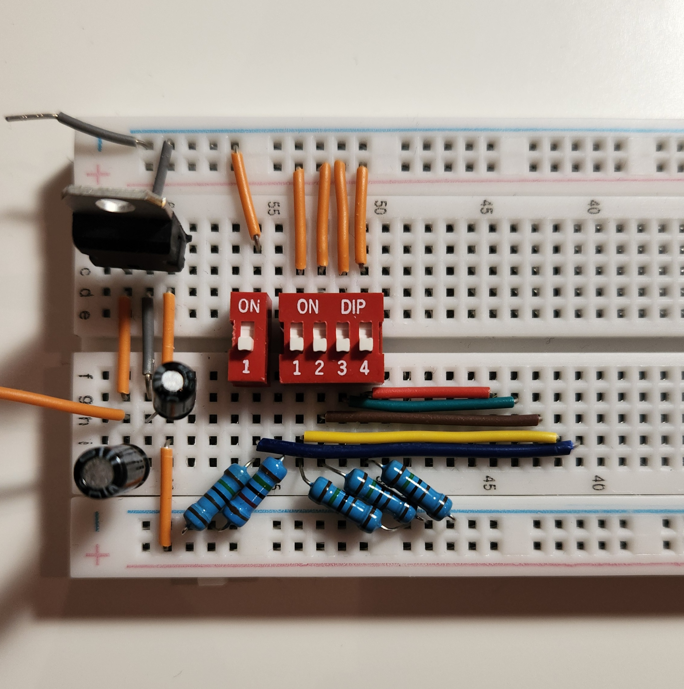

# 5-Bit Binary to Decimal Display (No Microcontrollers)

This is a simple hardware project that turns a 5-bit binary number into a decimal output using 74-series logic chips. It uses a basic binary-to-BCD conversion to drive three 7-segment displays—no microcontrollers, no firmware, just plain old logic gates. 

Built mainly for fun and learning, it was a way to dive deeper into electronics and explore what can be made without relying on code. 

It was surprisingly fascinating to implement what seemed like a "simple" algorithm entirely in hardware.

I've also included an alternative for building same project [`binary-to-decimal-display-2nd-option`](./binary-to-decimal-display-2) using different chips.

## What This Does

- Takes a 5-bit binary input from DIP switch
- Using **74-series logic chips**
- Outputs the corresponding decimal number using 2 **7-segment displays** 

---

## Why I Built It

- Practice using logic gates and 74-series chips
- Avoid relying on microcontrollers or pre-programmed solutions
- Build something tangible and satisfying just using logic and a battery

---

## Components I Used

- 74-series logic chips, I used only AND, OR and NOT
- Voltage Regulator LM7805
- 2 x 7-segment display decoder (like 74LS47)
- 2 x 7-segment displays
- DIP switches (5 bits)
- 2 Capacitors - 47µF, 0.1µF
- Resistors (see steps)
- Breadboard and jumper wires
- Battery 9V and allegators clips
- Optional: LEDs and Multimeter for debug and testing

---

## How It Works
 Based on the 5-bit input from the DIP switch, the circuit uses logic gates to generate two outputs:s:
  - 2-bit output for the **tens** place. This goes into a small logic circuit that converts it into BCD and sends it to a 7-segment display
  - 4-bit output for the **units** place, which is connected to a 74LS47 BCD-to-7-segment driver and another display.

---


## Steps

### 1. Connect Voltage regulator  

Before connecting anything else, it's important to make sure the voltage is right. Most 74-series chips require a stable 5V DC supply. If you're using a 9V battery (like I did), you'll need a voltage regulator to step it down to 5V, you risk burning out the chips.

I used an **LM7805** voltage regulator. Here's how to wire it:

- **Pin 1** → Input: connect to the 9V battery  
- **Pin 2** → Ground: connect to GND  
- **Pin 3** → Output: this will give you 5V

To stabilize the voltage I added two capacitors:
- A **47µF** capacitor between Pin 1 and GND  
- A **0.1µF** capacitor between Pin 3 and GND

After wiring it up, use a multimeter to check the output. It should read close to 5V before powering any of your logic chips.

> Note: If you're using a regulated bench power supply set to 5V, you can skip the voltage regulator.

<p>
  
  
</p>

### 2. Connect 5-bit DIP Switch

I'm not sure if standalone 5-bit DIP switches exist, so I used a combination of a 4-bit and a 1-bit switch. Each switch is wired as follows:

- One side of each switch is connected to **5V**  
- The other side is connected to the **input pins** of the logic circuit  
- Each input is also pulled down to **GND** using **15kΩ resistors**, to ensure a clear LOW state when the switch is off  
- Add jumper wires from each switch output and plug them into empty breadboard rows for now, or you can add the LEDs tempporary to test.


  
### 3. Connect BCD logic and 7-segment displays  

On a separate breadboard, connect the **74LS47** and the **7-segment display**. There are plenty of datasheets online for both components if you need pinouts.
Don’t forget to add **current-limiting resistors** for each segment of the display—values between **220Ω and 470Ω** work well, depending on brightness.

For testing, connect the **A, B, C, and D** inputs of the 74LS47 to either **GND or 5V** manually, and play around with different binary combinations. This is a good way to confirm that the correct numbers are being shown on the display before wiring it up to the rest of the logic circuit.

### 4. Wiring the First Digit (Tens Place)

Since I couldn’t figure out how to cleanly use a 2-digit 7-segment display (if you know how, feel free to DM me!), I went with a simple solution: use one display for the **tens** and another for the **units**.

Because the input is only 5 bits (values 0–31), the tens digit will only ever be 0, 1, 2, or 3. In binary, that means:

0000  
0001  
0010  
0011

So, the `D` and `C` inputs of the 74LS47 connected to the tens display will **always be 0**, and you can connect them directly to GND.

#### Logic for Input B (of 74LS47)

Looking at the binary values from 20 to 31:
```
Dec   E D C B A
20    1 0 1 0 0
21    1 0 1 0 1
...
30    1 1 1 1 0
31    1 1 1 1 1
```
So, B would be easy to set up:
- From **20 to 31**: when `E = 1`, and `D` or `C` is high  

That gives us the logic formula:

<pre>B = E ∧ (D ∨ C)</pre>

#### Logic for Input A (of 74LS47)

This one’s a bit more complex. The input `A` should be high in three ranges:

- **From 10 to 15**:  
  `E = 0`, `D = 1`, `B or C is high`  
  → **Condition 1**: `¬E ∧ D ∧ (B ∨ C)`

- **From 16 to 19**:  
  `E = 1`, `D = 0`, `C = 0`  
  → **Condition 2**: `E ∧ ¬D ∧ ¬C`

- **For 30 and 31**:  
  `E = 1`, `D = 1`, `C = 1`, `B = 1`  
  → **Condition 3**: `E ∧ D ∧ C ∧ B`


So the full logic expression is:

<pre> <strong>A</strong> = (¬E ∧ D ∧ (B ∨ C)) <strong>∨</strong> (E ∧ ¬D ∧ ¬C) <strong>∨</strong> (E ∧ D ∧ C ∧ B) </pre>

#### Gate Usage & Layout

To build this with basic gates, I used:
- 2 AND gates
- 1 OR gate
- 1 NOT gate
- 1 74LS47 decoder
- 1 7-segment-display
- 7 Resistors for the display

I placed some gates (like an AND and a NOT) in the center of the board so they could be reused later for the second digit's logic. The final OR gate is located near the 74LS47, as it directly feeds into it.

I used a multimeter to track down any incorrect or missing connections while debugging.

The diagram below reflects the most recent wiring. (Note that some connections in the photo have since been modified to allow more components to be reused for the second digit).


### 5. Wiring the Second Digit (Units)

To build this with basic gates, I used:
- 5 AND gates  
- 3 OR gate  
- 1 74LS47 decoder
- 1 7-segment-display
- 7 Resistors for the display
  
I was trying to reuse the results from connecting first digit: 

From **AND**: E ∧ D, E ∧ D ∧ C, ¬D ∧ ¬C, B ∧ C, 

From **NOT**: ¬E, ¬D, ¬C, ¬B
#### Logic for Input A (of 74LS47)
Just connecting A, 1st output to A

#### Logic for Input B (of 74LS47)
The most complicated, maybe I had to leave at the end, and wire it after C and D. 
<pre> 
<strong>B1</strong> = ¬E ∧ ¬D ∧ B
<strong>B2</strong> = ¬E ∧ ¬D ∧ B ∧ ¬C
<strong>B3</strong> = ¬E ∧ D ∧ C ∧ ¬B
<strong>B4</strong> = E ∧ ¬D ∧ ¬C ∧ ¬B
<strong>B5</strong> = E ∧ ¬D ∧ C ∧ B
<strong>B6</strong> = E ∧ D ∧ ¬C ∧ ¬B
 
B = OR of B1-6
</pre> 

As many of logical blocks are repeating, I split it in blocks to reuse it:
From building A, 1st digit:
- 1 = E ∧ D
- 2 = E ∧ D ∧ C
From Building B, 2nd digit
- 5 = C ∧ B
- 6 = ¬E ∧ ¬D
- 7 = ¬C ∧ B
- 8 = ¬E ∧ D
- 9 = C ∧ ¬B
- 10 = ¬E ∧ D
- 11 = ¬C ∧ ¬B

#### Logic for Input C (of 74LS47)
<pre>
<strong>C1</strong> = ¬E ∧ ¬D ∧ C
    (6 and C)
<strong>C2</strong> = ¬E ∧ D ∧ C ∧ B
    (8 and 5)
<strong>C3</strong> = E ∧ D ∧ ¬C ∧ ¬B
    (10 and 11)
<strong>C4</strong> = E ∧ D ∧ ¬C
    (1 and ¬C)

C = C1 or C2 or C3 or C4
</pre>

#### Logic for Input D (of 74LS47)
<pre>
<strong>D1</strong> = ¬E ∧ D ∧ ¬C ∧ ¬B 
    (8 and 10)
<strong>D2</strong> = E ∧ ¬D ∧ ¬C ∧ B
    (10 and 7)
<strong>D3</strong> = E ∧ D ∧ C ∧ ¬B
     (1 and 9)

D = D1 or D2 or D3
</pre>
Diagram for the second digit connection:


Wiring:


It was a fun build, more about experimenting, learning, and enjoying the process. If you’re working on something similar or have suggestions, I’d love to hear from you.
